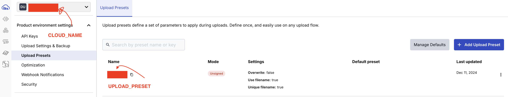
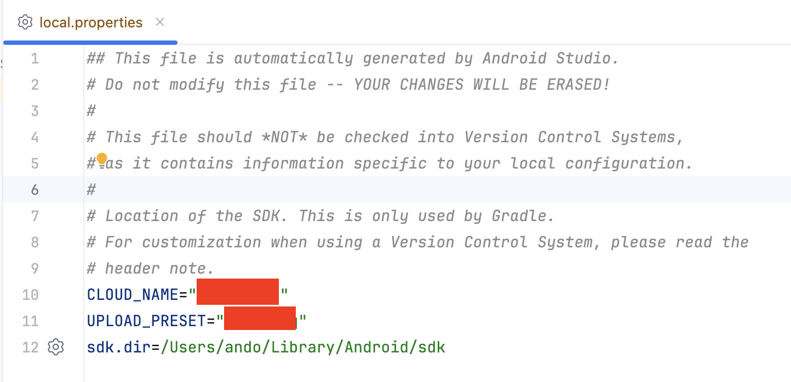

# Development Environment

Android Studio Ladybug

# Android Pixel 9 Pro Fold API Baklava

[capture.webm](https://github.com/user-attachments/assets/34b27d8f-c97a-4a66-bbf7-876ef152d6c0)

# Preparation for Running the Cloudinary App

## Obtain CLOUD_NAME and UPLOAD_PRESET from the Cloudinary Dashboard

## Add CLOUD_NAME and UPLOAD_PRESET to `local.properties`

# References
https://cloudinary.com/documentation/android_integration 